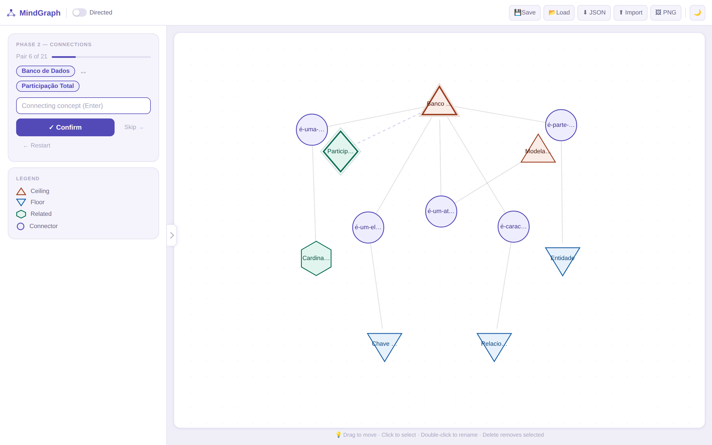
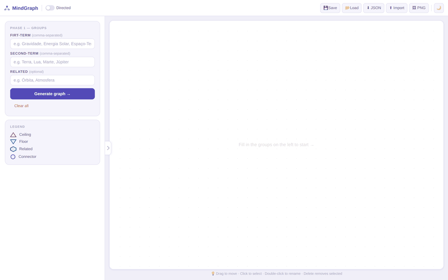
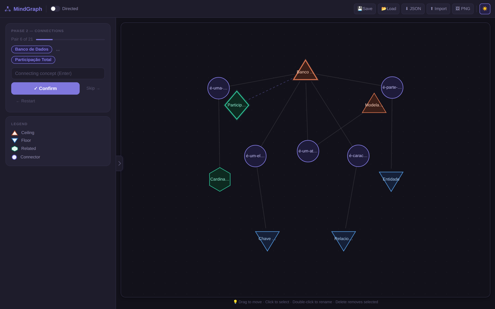

<p align="center">
  
</p>

<h1 align="center">MindGraph 🧠</h1>

<h4 align="center">
A browser-based mind mapping tool for building and exploring concept graphs — no install, no backend, no account.
</h4>

<p align="center">


</p>

<p align="center">
  <a href="https://luisacampanhah.github.io/MindGraph/"><b>🌐 Try the live demo</b></a>
</p>

<p align="center">
<a href="#-the-idea">The Idea</a> •
<a href="#-demo">Demo</a> •
<a href="#-features">Features</a> •
<a href="#-how-it-works">How It Works</a> •
<a href="#-tech-stack">Tech Stack</a> •
<a href="#-getting-started">Getting Started</a> •
<a href="#-project-structure">Structure</a> •
<a href="#-roadmap">Roadmap</a>
</p>

---

## 💡 The Idea

Building a concept map or a small ontology by hand is usually unstructured: you drop nodes on a canvas and connect whatever comes to mind, with no clear method for deciding *what* to connect or *when* the map is "done."

**MindGraph** guides the process instead of leaving it fully open-ended. You start by defining two anchor sets of concepts — a **Ceiling** (broad/top-level ideas) and a **Floor** (specific/target ideas) — plus optional **Related** terms. The tool then walks you through every pair of concepts one at a time and asks: *is there a relationship here, and what connects them?* The result is a graph built on purpose, not just clicked into existence.

## 🎬 Demo

<p align="center">
  
</p>

<p align="center"><i>Defining Ceiling / Floor / Related groups → generating the graph → walking through connections → dark mode.</i></p>

|  |  |
|:---:|:---:|
|  |  |
| Light mode | Dark mode |

**[→ Open the live demo](https://luisacampanhah.github.io/MindGraph/)** — runs entirely in your browser, nothing is sent anywhere.

---

## ✨ Features

- **Visual graph builder** — create nodes and connections interactively on an HTML5 canvas
- **Guided grouping** — organize concepts into **Ceiling**, **Floor**, and **Related** categories, each rendered with a distinct shape
- **Guided connection flow** — step through every node pair and define the relationship (or skip it) instead of freeform linking
- **Force-directed layout** — nodes settle into place automatically via a lightweight physics simulation
- **Directed edges** — optional arrows to represent asymmetric relationships
- **Drag & drop** — reposition any node freely
- **Rename & delete** — double-click to rename a node, select + `Delete` to remove it
- **Save / Load** — persist a session and pick it back up later
- **Export** — download the graph as **JSON** (for re-import) or as a **PNG** image
- **Dark mode** — toggle from the top bar

## 🧭 How It Works

**Phase 1 — Define your groups**

| Field | Description |
|---|---|
| Ceiling | Top-level concepts (rendered as upward triangles) |
| Floor | Ground-level / target concepts (rendered as downward triangles) |
| Related | Supporting concepts, optional (rendered as hexagons) |

**Phase 2 — Build connections**

MindGraph steps through every relevant pair of nodes and asks you to name the concept that connects them. Type it and press `Enter` to confirm, or skip the pair if there's no meaningful link.

**Controls**

| Action | How |
|---|---|
| Move node | Click and drag |
| Select node | Click |
| Rename node | Double-click |
| Delete node | Select + `Delete` |
| Confirm pair | `Enter` |
| Skip pair | `Escape` or the Skip button |
| Toggle directed edges | Topbar checkbox |
| Toggle dark mode | 🌙 button, topbar |

---

## 🛠️ Tech Stack

| Layer | Technology |
|---|---|
| Frontend | Vanilla JavaScript (ES6+) |
| Rendering | HTML5 Canvas API |
| Layout | Custom force-directed simulation |
| Styling | CSS3 |

No frameworks, no build step, no dependencies — clone it and open `index.html`.

---

## 🚀 Getting Started

```bash
git clone https://github.com/LuisaCampanhaH/MindGraph.git
cd MindGraph
open index.html   # or just double-click it
```

Or skip all that and try the **[live demo](https://luisacampanhah.github.io/MindGraph/)** (GitHub Pages).

---

## 📁 Project Structure

```
MindGraph/
├── index.html         # App entry point
├── style.css           # Styles (incl. light/dark theme)
├── script.js            # Graph engine + UI logic
└── assets/
    ├── demo.gif          # Animated walkthrough (used in this README)
    ├── screenshot-light.png
    └── screenshot-dark.png
```

---

## 🚧 Roadmap

- [ ] Edit node labels after creation from a dedicated panel
- [ ] Multiple layout algorithms (radial, hierarchical)
- [ ] Shareable read-only graph links
- [ ] Undo / redo

---

## 🤝 Contributing

Contributions are welcome — feel free to open an issue or a pull request.

## 📄 License

MIT License — use, modify, and distribute freely.

<br>

<p align="center">
Built by <a href="https://github.com/LuisaCampanhaH">Luisa Campanha</a>
</p>
